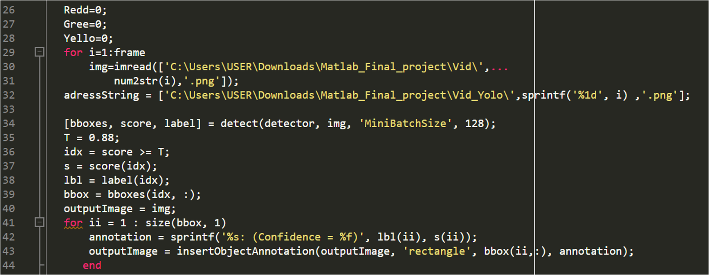

# DATA-SCIENCE

## Using Matlab to Identify Traffic Lights

Traffic lights play a crucial role in road safety, yet distractions and poor visibility can often lead to accidents. With the rise of artificial intelligence, it is possible to automate traffic light detection, improving road safety and assisting drivers, especially those who are colorblind or distracted.

### Motivation

We aimed to develop a method that detects traffic lights in real-time from video feeds, which could be applied to self-driving cars or as a driver aid system. The goal was to automatically detect red, yellow, and green lights, helping drivers to be more aware of their surroundings and making roads safer.

### Method

We used Matlab and two popular object detection models: **YOLOv2** and **Fast R-CNN**. YOLOv2 is a real-time object detection model that identifies and processes traffic light images at high speeds, while Fast R-CNN offers more accurate detection by using a two-stage process. 

1. **Video Processing**: The video input was first divided into individual frames to make it suitable for object detection.
2. **Object Detection**: We trained the YOLOv2 and Fast R-CNN models to detect traffic lights and their states (red, yellow, green) from these frames.
3. **Classification**: The detected lights were classified based on their color, enabling the system to determine whether to "GO", "STOP", or "SLOW" down.

### YOLOv2

YOLOv2  is known for its speed and efficiency, processing up to 150 frames per second. This made it ideal for real-time traffic light detection, ensuring fast response times even in dynamic driving environments.

### Results

The system successfully identified traffic lights from video inputs with high accuracy, achieving detection rates over 88%. The results were displayed with bounding boxes around the detected traffic lights, and corresponding labels ("STOP", "GO", "SLOW") were assigned based on the light's color.
<video controls src="Result.mp4" title="Title"></video>

### Future Work

We aim to extend this system by improving its accuracy and applying it to more complex driving environments. The model can also be enhanced to detect lights from various angles and distances, further aiding self-driving cars in making informed decisions.